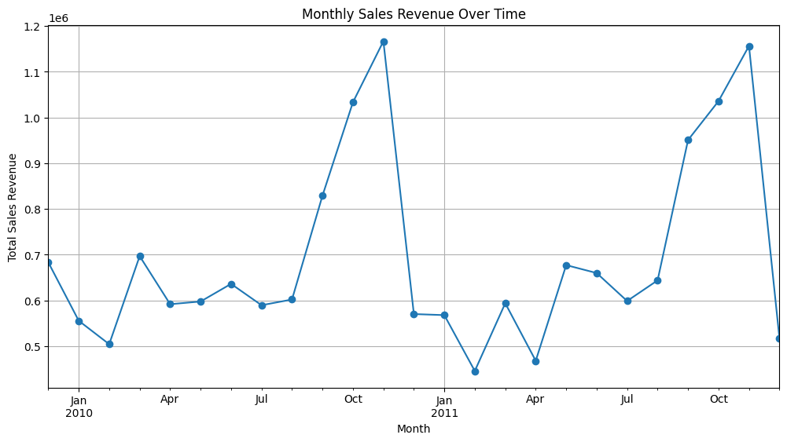
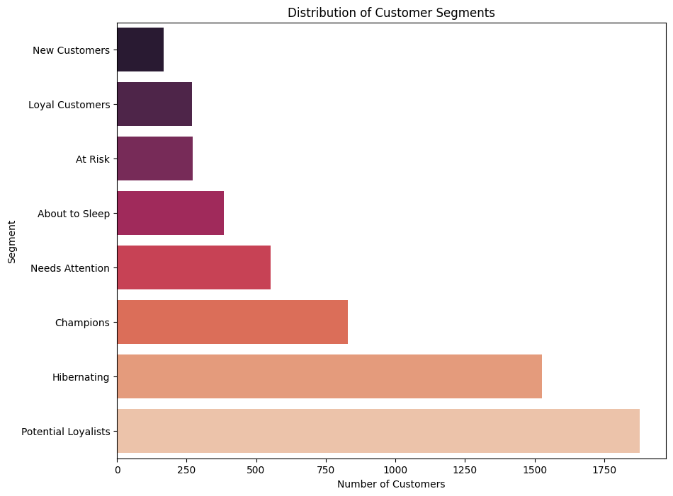

## Analysis Of A Transactional Dataset From a UK-Based Online Retailer (2009-2011)
This project analyzes a transactional dataset from a UK-based online retailer from 2009 to 2011. The primary goal is to perform an in-depth exploratory data analysis (EDA) to identify key sales trends and to conduct RFM (Recency, Frequency, Monetary) analysis to segment the customer base. The final output is a set of actionable customer segments that can be used to inform targeted marketing strategies.
### Key Questions Answered
* What are the top-selling products and biggest markets by revenue?
* What is the trend of sales revenue over time?
* Who are our most valuable customers and which customers are at risk of churning?
### Tools and Libraries Used
* Programming Language: Python
* Data Manipulation: Pandas
* Data Visualization: Matplotlib, Seaborn
* Development Environment: VS Code, Jupyter Notebook
## What is RFM Analysis (For those who don't know about it)
RFM analysis is a marketing and customer segmentation technique used to evaluate and group customers based on their purchasing behavior. 
* R - Recency: How recently a customer made a purchase. (The more recent, the better — recent buyers are more likely to buy again.)
* F - Frequency: How often a customer makes a purchase. (Frequent buyers are usually more loyal and valuable.)
* M - How much money a customer spends in total. (High spenders contribute more revenue and are considered high-value customers.)

### Key Findings & Visualizations
1. Sales Performance: 
The analysis revealed a significant upward trend in sales, with a pronounced peak in November of each year, likely due to holiday shopping.
The United Kingdom is by far the largest market, accounting for the vast majority of revenue.

2. Customer Segmentation:
The customer base was segmented into distinct groups using RFM analysis. The distribution of these segments is as follows:

* Champions (Score: 555): Our most valuable and loyal customers. They buy frequently, recently, and spend the most.
* Potential Loyalists: Recent customers with average frequency and spending. They can be nurtured into Champions.
* Hibernating (Score: 111-222): Customers who have not purchased in a long time. They represent a significant portion of the customer base and could be targeted with re-engagement campaigns.

### How to Run This Project
* Clone this repository.
* Create a virtual environment: python3 -m venv venv
* Activate it: source venv/bin/activate
* Install the required libraries: pip install pandas matplotlib seaborn openpyxl jupyter
* Run the Jupyter Notebook 01-Data-Exploration.ipynb.